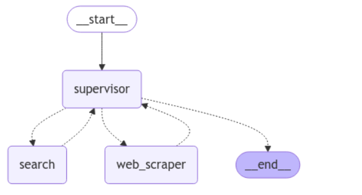
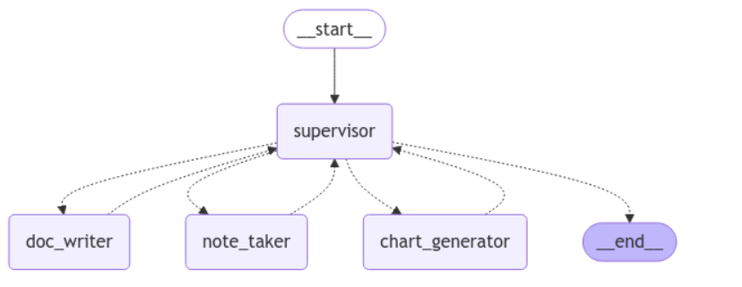
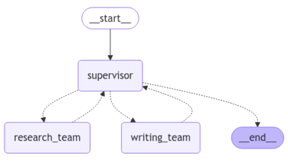

# Supervision_Policy

A powerful multi-agent system built with LangGraph that creates specialized AI teams for research and content generation. This system orchestrates multiple specialized agents to work together through a hierarchical structure of supervisors and workers.

## Overview

This project demonstrates how to build complex AI teams using LangGraph. It features:

- **Team-based Architecture**: Hierarchical structure with supervisors and specialized workers
- **Research Team**: Capable of searching the web and scraping content
- **Writing Team**: Creates outlines, writes documents, and generates charts
- **Supervisor Agents**: Coordinate work between specialized agents

## Architecture

The system is organized into three main graphs:

1. **Research Graph**: Handles information gathering
   - Search Agent: Uses Tavily to search the web
   - Web Scraper: Extracts content from websites
   


2. **Paper Writing Graph**: Manages content creation
   - Document Writer: Writes and edits documents
   - Note Taker: Creates outlines and reads documents
   - Chart Generator: Creates data visualizations
  


3. **Super Graph**: Coordinates between teams
   - Teams Supervisor: Decides whether to use the research or writing team
   - Research Team: Calls the research graph
   - Writing Team: Calls the paper writing graph




## Requirements

- Python 3.8+
- OpenAI API key
- Tavily API key
- Required packages:
  - langgraph
  - langchain
  - langchain_community
  - langchain_anthropic
  - langchain_experimental
  - langchain_openai

## Installation

```bash
pip install -U langgraph langchain_community langchain_anthropic langchain_experimental langchain_openai
```

## Environment Setup

You'll need to set the following environment variables:

```bash
export OPENAI_API_KEY=your_openai_api_key
export TAVILY_API_KEY=your_tavily_api_key
```

Or provide them when prompted by the application.

## Usage

The system can be used for a variety of tasks that combine research and content creation:

```python
# Example: Research AI agents and write a report
for s in super_graph.stream(
    {
        "messages": [
            ("user", "Research AI agents and write a brief report about them.")
        ],
    },
    {"recursion_limit": 10},
):
    print(s)
    print("---")
```

Other example tasks:
- Write an outline and full poem about cats
- Research Taylor Swift's next tour and create a summary
- Generate reports with data visualizations

## How It Works

1. The supervisor agent decides which team should handle the task
2. If research is needed, the Research Team:
   - Searches for information using Tavily
   - Scrapes websites for additional context
3. If content creation is needed, the Writing Team:
   - Creates an outline with the Note Taker
   - Writes content with the Document Writer
   - Generates visualizations with the Chart Generator
4. The teams report back to their supervisors who coordinate the workflow

## Tools

The system includes several specialized tools:

- **Document Tools**: create_outline, read_document, write_document, edit_document
- **Research Tools**: TavilySearchResults, scrape_webpages
- **Visualization Tools**: python_repl_tool for generating charts


