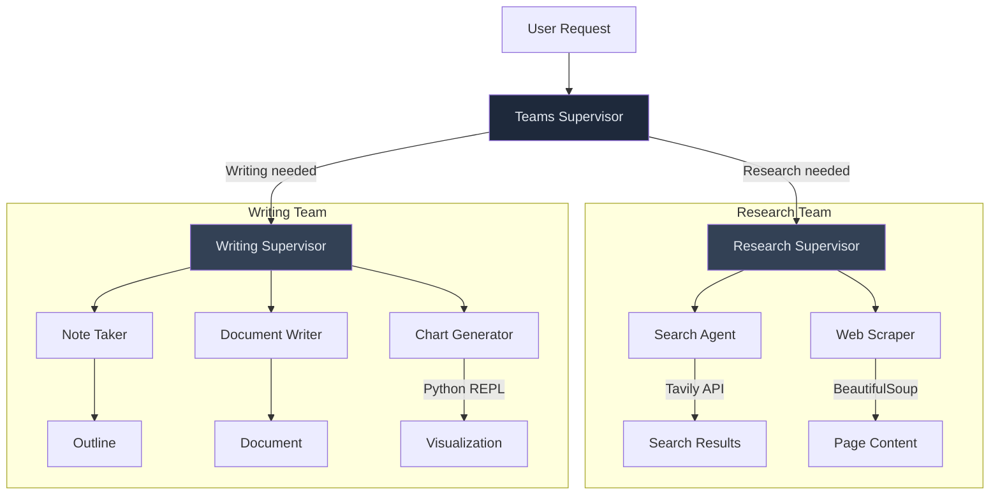

# Supervision Policy

Hierarchical multi-agent system built with LangGraph that coordinates specialized AI teams for research and content generation. A top-level supervisor delegates tasks to a Research Team and a Writing Team, each with their own sub-supervisors and worker agents.


```mermaid
flowchart TB
    A[User Request] --> B[Teams Supervisor]

    B -->|Research needed| C[Research Supervisor]
    B -->|Writing needed| D[Writing Supervisor]

    subgraph Research["Research Team"]
        C --> E[Search Agent]
        C --> F[Web Scraper]
        E -->|Tavily API| G[Search Results]
        F -->|BeautifulSoup| H[Page Content]
    end

    subgraph Writing["Writing Team"]
        D --> I[Note Taker]
        D --> J[Document Writer]
        D --> K[Chart Generator]
        I --> L[Outline]
        J --> M[Document]
        K -->|Python REPL| N[Visualization]
    end

    style B fill:#1e293b,color:#e2e8f0
    style C fill:#334155,color:#e2e8f0
    style D fill:#334155,color:#e2e8f0
```

## Architecture

The system is organized as three nested LangGraph state machines:

| Graph | Role | Agents |
|-------|------|--------|
| **Super Graph** | Top-level routing | Teams Supervisor |
| **Research Graph** | Information gathering | Search Agent (Tavily), Web Scraper (BeautifulSoup) |
| **Writing Graph** | Content creation | Note Taker, Document Writer, Chart Generator (Python REPL) |

Each supervisor uses structured LLM output to decide which worker to invoke next, continuing until the task is marked `FINISH`.

## Features

- **Hierarchical supervision** -- LLM-based routers at each level decide task delegation dynamically
- **Web research** -- Tavily search + full page scraping for deep information gathering
- **Document tools** -- Create outlines, write/edit documents, and read files within a sandboxed working directory
- **Chart generation** -- Python REPL tool for producing data visualizations on the fly
- **Composable graphs** -- Each team graph can be used independently or composed under the super graph

## Usage

```python
for s in super_graph.stream(
    {"messages": [("user", "Research AI agents and write a brief report.")]},
    {"recursion_limit": 10},
):
    print(s)
```

### Environment Setup

```bash
export OPENAI_API_KEY=your_key
export TAVILY_API_KEY=your_key
```

## Project Structure

```
Supervision_Policy/
├── research_agent_v3.ipynb    # Full implementation notebook
├── images/
│   ├── research.png           # Research team graph visualization
│   ├── paper.png              # Writing team graph visualization
│   └── final.png              # Super graph visualization
└── README.md
```

## Tech Stack

| Component | Technology |
|-----------|-----------|
| Orchestration | LangGraph (StateGraph, Command routing) |
| LLM | OpenAI (via LangChain) |
| Search | Tavily Search API |
| Scraping | LangChain WebBaseLoader |
| Code Execution | LangChain PythonREPL |
| Notebook | Jupyter / Google Colab |

## License

MIT
